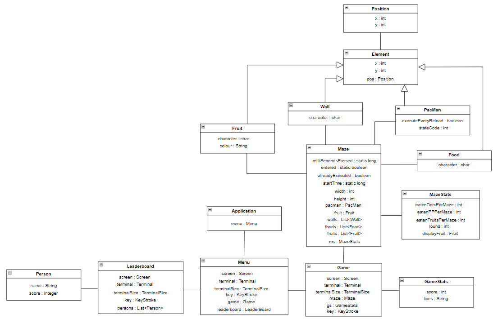
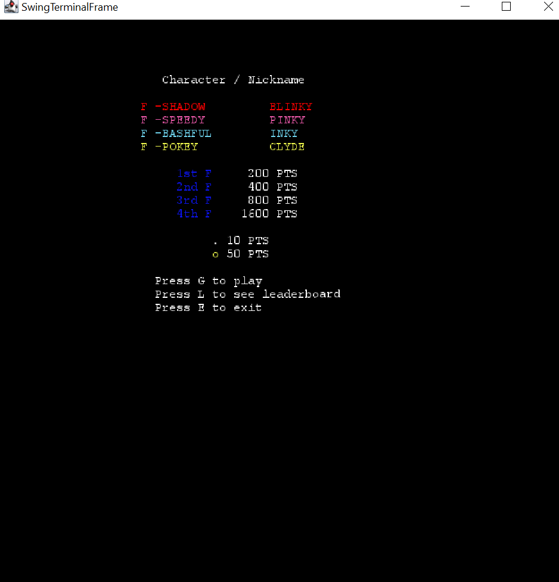
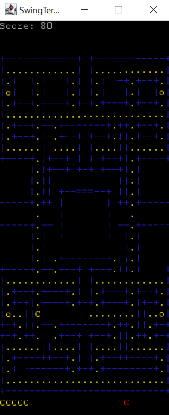
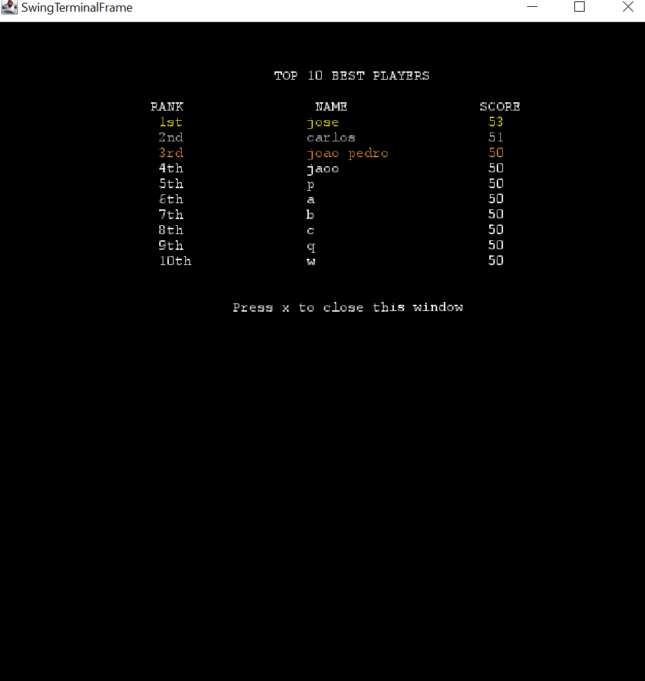
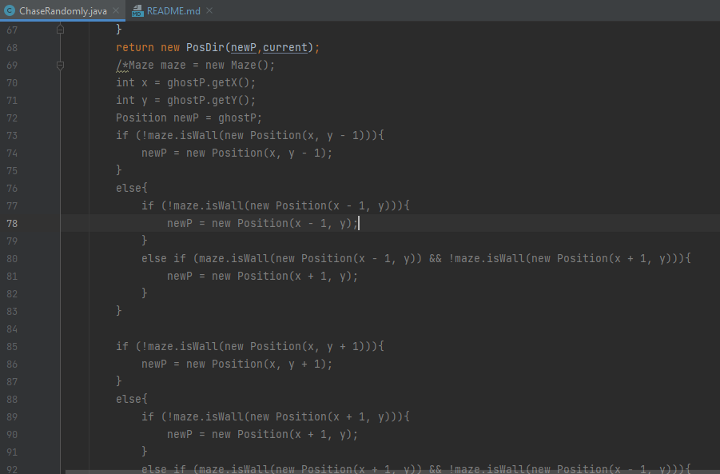

## LDTS_1102 - Pac Man
O objetivo do nosso projeto é implementar em Java uma réplica do jogo clássico do Pac-Man, de 1980, usando as funcionalidades do Lanterna.
Projeto desenvolvido por Inês Gaspar (up202007210@fe.up.pt), Marcos Aires (up202006888@fe.up.pt) e Pedro Gomes (up202006086@fe.up.pt) para a cadeira de LDTS no ano letivo 2021/2022.

### Funcionalidades Implementadas:
-**Menu Principal:** O Menu foi implementado com um design semelhante ao do Pac-Man original, com os nomes dos quatro fantasmas escritos nas suas respetivas cores e a especificação do valor de cada pellet, cada Power-Up e cada fantasma em pontos quando é comido pelo Pac-Man. Para jogar o jogo, o user deve pressionar G. Para consultar o leaderboard, o jogador pressiona L. Para fechar a aplicação, o utilizador pressiona E.

-**Leaderboard:** Implementamos um terminal próprio para o Leaderboard que mostra as 10 melhores pontuações e o nome que os jogadores que as alcançaram registaram quando jogaram o jogo. Os jogadores estão ordenados da pontuação mais alta para a mais baixa. Pressionando x, o jogador regressa ao Menu Principal.

-**Construção do Labirinto:** O Labirinto foi feito usando quatro tipos de carateres ASCII: "=" para o portão da casa dos fantasmas, "|" para paredes verticais, "-" para paredes horizontais e "+" para esquinas.

-**Colisões do Labirinto:** O Labirinto possui as suas colisões completamente implementadas, não permitindo ao Pac-Man atravessar as paredes em nenhuma direção.

-**Contagem de Pontos:** Sempre que o Pac-Man come um pellet, a sua pontuação aumenta em 10 pontos. Sempre que se alimenta de um Power Up, a pontuação aumenta em 50 pontos.

-**Buracos do Labirinto:** Quando o Pac-Man atravessa um buraco nos limites do labirinto, é teletransportado para o buraco na outra extremidade e pode continuar a sua movimentação.

-**Frutas:** Ocasionalmente, frutas irão surgir em posições aleatórias do labirinto. Comê-las dará uma quantidade de pontos superior à de um pellet normal.

-**Movimento Constante do Pac Man:** O Pac Man move-se por tempo indefinido numa direção até receber outro input no teclado ou encontrar uma parede no seu caminho. Nesta segunda situação, fica imóvel até receber um novo input.

### Funcionalidades a Implementar:
-**Fantasmas:** Cada fantasma possui um comportamento próprio durante o jogo, definindo os seus movimentos com base na posição atual do Pac-Man e movendo-se mesmo que o Pac-Man esteja parado. Os fantasmas devem entrar em modo de fuga quando o Pac-Man consome um Power Up. Se o Pacman tocar num fantasma sem este estar no modo de fuga, o Pac Man perde uma vida.

-**Power Ups:** Comer um Power Up permite ao Pac Man comer os fantasmas em que toque durante os 8 segundos seguintes. Durante a duração do Power Up, os fantasmas entram em modo de fuga, procurando fugir do Pac Man em vez de persegui-lo.

### Diagrama UML



### Design







#### <Inserir problema encontrado aqui>
### 1. Model-View-Controller
**Contexto do Problema:**
  
  De modo a conseguirmos ter um jogo funcional, dividimos o código todo em classes da forma que consideramos mais adequada até ao momento. Porém, é facto de que o código ainda não se encontra dividido em pacotes, sendo notório também que ainda não há uma distinção totalmente clara sobre o que algumas classes fazem (temos, por exemplo, o caso do Pacman, que se desenha a si próprio, atualiza a sua posição e ainda guarda a sua informação, nomeadamente a posição em que se encontra). Isto, porém viola o Single Responsibilty Principle, que refere que, segundo Robert C. Martin: "A class should have one, and only one, reason to change.", ou seja, a cada classe deve caber apenas uma responsabilidade específica.


  
**O Pattern:** 
  
  Assim, pretendemos depois implementar, visando já as entregas que se avizinham, este MVC (Model-View-Control), que se foca, acima de tudo, no princípio de que a parte de interação com o utilizador (input e apresentação) deve ser separada da parte dos dados do programa e sua manipulação. 
  
 


 
  Como está ilustrado no esquema, este pattern consiste numa divisão tridimensional do código, em que o view diz respeito à parte de interação com o utilizador, o modelo aos dados do programa e o controlador, que manipula os dados e decide como estes vão ser mostrados. Explicando o fluxo de uma forma sucinta, o utilizador do programa faz uma solicitação ao programa, que é tratada pelo controller, que manipula o modelo de acordo com a solicitação e recebe informação do mesmo como resposta, atualizando o que está no view e que vai ser mostrado ao utilizador.
  Pretendemos aplicar este padrão visto que não fazer esta separação poderia causar alguns efeitos indesejados no nosso software. Explicitando, quantas mais responsabilidades couberem a só uma classe (ou seja caso uma classe tenha responsabilidades que digam respeito à parte do controller e à parte do view, como por exemplo acontece com a classe PacMan, que atualiza a sua posição- controller- e desenha-se -view) vai ser necessária alterá-la mais vezes do que seria preciso caso ela tivesse apenas uma responsabilidade em concreto, o que aumenta a probabilidade de efeitos secundários indesejados aquando da alteração e torna tudo mais propício a erros, o que apenas causaria mais trabalho do que deveria.
  
**Implementação:**
  
<Esquematização de como o Pattern foi aplicado ao programa>
**Impacto:**
<Efeitos que a aplicação do pattern teve sobre o código>

### 2. Game programming pattern
**Contexto do Problema:**
  
  Tal como acontece na maior parte dos jogos, pretendemos também implementar um loop principal no nosso. Tal se deve ao facto de, como sabemos, um jogo não parar mesmo quando o jogador deixa de dar input à máquina, ou seja, mesmo que o jogador para de jogar, as animações do jogo continuam a atualizar, isto é, o jogo não congela, dado que os diferentes elementos de um jogo têm que ter ações independentes das ações de outros elementos.
  
**O Pattern:**  
  

``` java
while (true)
{
  double start = getCurrentTime();
  processInput();
  update();
  render();

  sleep(start + MS_PER_FRAME - getCurrentTime());
}
  
  ```
  
  Este loop permite, por fases, receber input de um user e processá-lo (processInput()), atualizar o estado do jogo, movendo os seus elementos por exemplo (update()), e renderizar os gráficos, isto é, desenhar os elementos no ecrã (render()). O método sleep permite controlar a velocidade do jogo.
  
### Code Smells Detetados e Soluções de Refactoring
#### <Nome do Code Smell Detetado>
<Explicação do Code Smell e dos problemas que este causa + Processo de Resolução Aplicado>

#### Dead Code
Na verificação do código do nosso projeto, encontramos ocorrências de Dead Code sobre a forma de versões anteriores de código que ficaram comentadas em algumas classes. Por exemplo, após a alteração do funcionamento do método chase na classe ChaseRandomly (imagem abaixo). Esta situação torna o código desnecessariamente grande e diminui organização do código, pelo que a melhor forma de resolver o problema neste contexto será remover o código comentado, tornando o código final mais limpo e fácil de ler.




#### Duplicate Code
Quando analisamos o código do projeto, encontramos código repetido e redundante, em particular na classe Element tínhamos duplicado os atributos de Position, atributo que também é declarado na classe.

Fragmento do código de Position
```
private int x, y;
    private int velX = 0, velY = 0;

    public Position(int a, int b) {
        x = a;
        y = b;
    }

    public int getX() {
        return x;
    }

    public int getY() {
        return y;
    }
```

Fragmento do código de Element antes de detetarmos o code smell
```
 private int x;
    private int y;
    protected Position pos;

    public Element(int x, int y){
        pos = new Position(x, y);
    }

    public Position getPosition(){
        return pos;
    }
```

#### <Nome do Code Smell Detetado>
<Explicação do Code Smell e dos problemas que este causa + Processo de Resolução Aplicado>

### Testagem

### Auto-Avaliação

