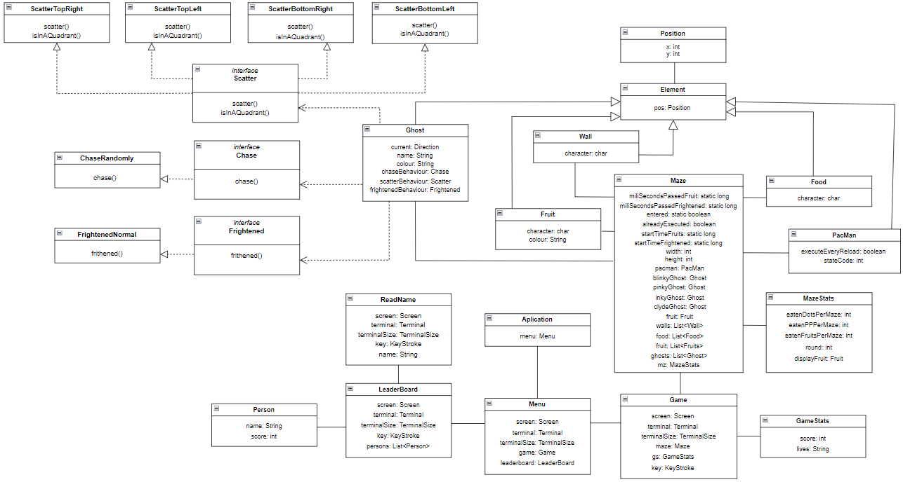
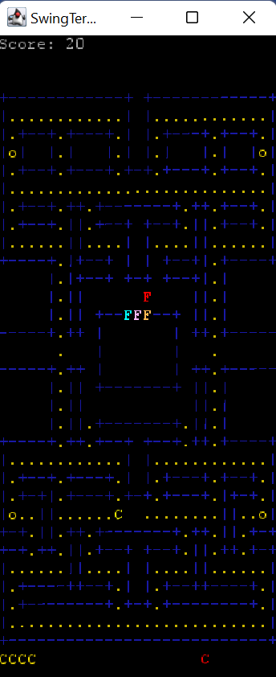
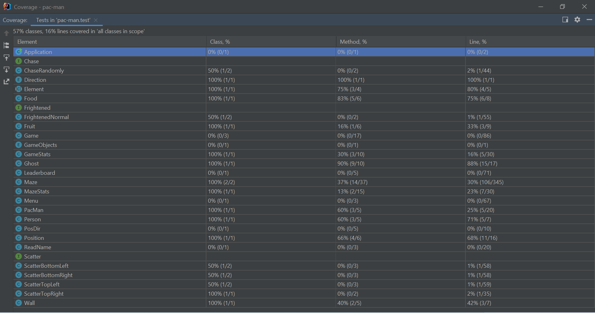

## LDTS_1102 - Pac Man
O objetivo do nosso projeto é implementar em Java uma réplica do jogo clássico do Pac-Man, de 1980, usando as funcionalidades do Lanterna.
Projeto desenvolvido por Inês Gaspar (up202007210@fe.up.pt), Marcos Aires (up202006888@fe.up.pt) e Pedro Gomes (up202006086@fe.up.pt) para a cadeira de LDTS no ano letivo 2021/2022.

### Funcionalidades Implementadas:
-**Menu Principal:** O Menu foi implementado com um design semelhante ao do Pac-Man original, com os nomes dos quatro fantasmas escritos nas suas respetivas cores e a especificação do valor de cada pellet, cada Power-Up e cada fantasma em pontos quando é comido pelo Pac-Man. Para jogar o jogo, o user deve pressionar G. Para consultar o leaderboard, o jogador pressiona L. Para fechar a aplicação, o utilizador pressiona E.

-**Leaderboard:** Implementamos um terminal próprio para o Leaderboard que mostra as 10 melhores pontuações e o nome que os jogadores que as alcançaram registaram quando jogaram o jogo. Os jogadores estão ordenados da pontuação mais alta para a mais baixa. Pressionando x, o jogador regressa ao Menu Principal.

-**Construção do Labirinto:** O Labirinto foi feito usando quatro tipos de carateres ASCII: "=" para o portão da casa dos fantasmas, "|" para paredes verticais, "-" para paredes horizontais e "+" para esquinas.

-**Colisões do Labirinto:** O Labirinto possui as suas colisões completamente implementadas, não permitindo ao Pac-Man atravessar as paredes em nenhuma direção.

-**Contagem de Pontos:** Sempre que o Pac-Man come um pellet, a sua pontuação aumenta em 10 pontos. Sempre que se alimenta de um Power Up, a pontuação aumenta em 50 pontos.

-**Buracos do Labirinto:** Quando o Pac-Man atravessa um buraco nos limites do labirinto, é teletransportado para o buraco na outra extremidade e pode continuar a sua movimentação.

-**Frutas:** Ocasionalmente, frutas irão surgir em posições aleatórias do labirinto. Comê-las dará uma quantidade de pontos superior à de um pellet normal.

-**Movimento Constante do Pac Man:** O Pac Man move-se por tempo indefinido numa direção até receber outro input no teclado ou encontrar uma parede no seu caminho. Nesta segunda situação, fica imóvel até receber um novo input.

### Funcionalidades a Implementar:
-**Fantasmas:** Cada fantasma possui um comportamento próprio durante o jogo, definindo os seus movimentos com base na posição atual do Pac-Man e movendo-se mesmo que o Pac-Man esteja parado. Os fantasmas devem entrar em modo de fuga quando o Pac-Man consome um Power Up. Se o Pacman tocar num fantasma sem este estar no modo de fuga, o Pac Man perde uma vida.

-**Power Ups:** Comer um Power Up permite ao Pac Man comer os fantasmas em que toque durante os 8 segundos seguintes. Durante a duração do Power Up, os fantasmas entram em modo de fuga, procurando fugir do Pac Man em vez de persegui-lo.

### Diagrama UML



### Design





### 1. Model-View-Controller
**Contexto do Problema:**
  
  De modo a conseguirmos ter um jogo funcional, dividimos o código todo em classes da forma que consideramos mais adequada até ao momento. Porém, é facto de que o código ainda não se encontra dividido em pacotes, sendo notório também que ainda não há uma distinção totalmente clara sobre o que algumas classes fazem (temos, por exemplo, o caso do Pacman, que se desenha a si próprio, atualiza a sua posição e ainda guarda a sua informação, nomeadamente a posição em que se encontra). Isto, porém viola o Single Responsibilty Principle, que refere que, segundo Robert C. Martin: "A class should have one, and only one, reason to change.", ou seja, a cada classe deve caber apenas uma responsabilidade específica.

**O Pattern:** 
  
  Assim, pretendemos depois implementar, visando já as entregas que se avizinham, este MVC (Model-View-Control), que se foca, acima de tudo, no princípio de que a parte de interação com o utilizador (input e apresentação) deve ser separada da parte dos dados do programa e sua manipulação. 
  
 


 
  Como está ilustrado no esquema, este pattern consiste numa divisão tridimensional do código, em que o view diz respeito à parte de interação com o utilizador, o modelo aos dados do programa e o controlador, que manipula os dados e decide como estes vão ser mostrados. Explicando o fluxo de uma forma sucinta, o utilizador do programa faz uma solicitação ao programa, que é tratada pelo controller, que manipula o modelo de acordo com a solicitação e recebe informação do mesmo como resposta, atualizando o que está no view e que vai ser mostrado ao utilizador.
  Pretendemos aplicar este padrão visto que não fazer esta separação poderia causar alguns efeitos indesejados no nosso software. Explicitando, quantas mais responsabilidades couberem a só uma classe (ou seja caso uma classe tenha responsabilidades que digam respeito à parte do controller e à parte do view, como por exemplo acontece com a classe PacMan, que atualiza a sua posição- controller- e desenha-se -view) vai ser necessária alterá-la mais vezes do que seria preciso caso ela tivesse apenas uma responsabilidade em concreto, o que aumenta a probabilidade de efeitos secundários indesejados aquando da alteração e torna tudo mais propício a erros, o que apenas causaria mais trabalho do que deveria.
  
**Implementação:**
Não conseguimos implementar este pattern

**Impacto:**
Não conseguimos aplicar este pattern, pelo que não teve impacto no nosso código

### 2. Game programming pattern
**Contexto do Problema:**
  
  Tal como acontece na maior parte dos jogos, pretendemos também implementar um loop principal no nosso. Tal se deve ao facto de, como sabemos, um jogo não parar mesmo quando o jogador deixa de dar input à máquina, ou seja, mesmo que o jogador para de jogar, as animações do jogo continuam a atualizar, isto é, o jogo não congela, dado que os diferentes elementos de um jogo têm que ter ações independentes das ações de outros elementos.
  
**O Pattern:**  

``` java
while (true) {
            try {
                Thread.sleep(170);
                render();
                processInput(game);
                updateGhosts(game);
                if (key.getKeyType() == EOF) {
                    break;
                }
            } catch (IOException | InterruptedException e) {
                e.printStackTrace();
            }
        }
  ```
  
  Este loop permite, por fases, renderizar os elementos do jogo inicialmente, receber e processar um input do jogador e atualizar os fantasmas mediante esse input. O método sleep faz a thread principal parar por 0.17 segundos para regular a velocidade do jogo.

**Implementação**

Para implementar o game loop usamos um ciclo while(true), onde são invocadas as funções que permitem que o tempo controlar o tempo do jogo.

```
private void render() throws IOException, InterruptedException {
        if (!Maze.alreadyExecuted) { //this is only called every time the screen is reloaded (the players eats all food or loses one life)
            TimeUnit.SECONDS.sleep(1);
            Maze.alreadyExecuted = true;
        }
        TextGraphics graphics = screen.newTextGraphics();
        screen.clear();
        gs.drawGameElements(graphics);
        maze.drawMazeElements(graphics);
        screen.refresh();
    }

    public void run(Game game) {
        key = new KeyStroke(KeyType.ArrowLeft);
        //startTimeScatter = System.currentTimeMillis();
        while (true) {
            try {
                Thread.sleep(170);
                render();
                processInput(game);
                updateGhosts(game);
         
         //continue
    }     
```
**Impacto**

A aplicação deste pattern permitiu-nos manter o código mais organizado e simples de compreender, bem como pemritiu que o jogo tivesse uma velocidade adequada. Porém, em alguns computadores este pattern pode tornar o jogo mais lento do que o desejável.

### 3. Strategy pattern
**Contexto do Problema:**
  
  Ao nos depararmos com a complexidade elevada do movimento dos fantasmas no jogo, apercebemo-nos de que uma estratégia de programar para uma implementação não seria a mais adequada para a resolução do nosso problema, dado que tal abordagem não seria nada reutilizável, implicando portanto mudanças bruscas no código caso houvesse a hipotética necessidade de, por exemplo, mudar a estratégia de movimento dos fantasmas, o que levaria a uma maior probabilidade de ocorrência de falhas no código. Sendo assim, e pesando todos os prós e contras desta abordagem, chegamos a um consenso que seria de maior proveito aplicar o strategy pattern, que se alinha com o princípio de programar para uma interface, em detrimento de programar para uma implementação. Neste sentido, decidimos criar três interfaces diferentes, sendo que cada uma representa um dos tipos de movimento dos fantasmas (scatter, que corresponde a um movimento caracterizado pelo deslocamento dos fantasmas para os respetivos cantos do mapa; frightened, que corresponde ao movimento em que os fantasmas fogem do pacman e chase, em que os fantasmas perseguem o pacman). Cada uma destas interfaces tem uma ou mais classes que representam uma ou mais implementações de cada um dos modos do movimento dos fantasmas (contamos com quatro modos de scatter, um modo de chase e um modo de frightened).
  
  **O Pattern:**
  
  
  **Implementação:**
  
  Como se pode observar pela imagem abaixo, temos as três interfaces (chase, scatter e frightened) e temos cada uma das classes respetivas que implementam essas interfaces e que se encarregam por tratar de cada um desses movimentos dos fantasmas

  

  **Impacto:**
  
  A implementação deste strategy pattern permite tornar o código mais reutilizável e permitiu-nos implementar um tipo de chase apenas para todos os fantasmas (o frightened já é o mesmo originalmente para todos, e cada fantasma no nosso jogo tem um tipo de scatter). Caso queiramos mudar a estratégia de movimento temos apenas que, em vez de mudar o código todo, manipular a interface respetiva e implementar esse outro tipo de estratégia de movimento.
  
### Code Smells Detetados e Soluções de Refactoring

#### Dead Code
Na verificação do código do nosso projeto, encontramos ocorrências de Dead Code sobre a forma de versões anteriores de código que ficaram comentadas em algumas classes. Por exemplo, após a alteração do funcionamento do método chase na classe ChaseRandomly (imagem abaixo). Esta situação torna o código desnecessariamente grande e diminui organização do código, pelo que a melhor forma de resolver o problema neste contexto será remover o código comentado, tornando o código final mais limpo e fácil de ler.


#### Duplicate Code
Quando analisamos o código do projeto, encontramos código repetido e redundante, em particular na classe Element tínhamos duplicado os atributos de Position, atributo que também é declarado na classe.

Fragmento do código de Position
```
private int x, y;
    private int velX = 0, velY = 0;

    public Position(int a, int b) {
        x = a;
        y = b;
    }

    public int getX() {
        return x;
    }

    public int getY() {
        return y;
    }
```

Fragmento do código de Element antes de detetarmos o code smell
```
 private int x;
    private int y;
    protected Position pos;

    public Element(int x, int y){
        pos = new Position(x, y);
    }

    public Position getPosition(){
        return pos;
    }
```

#### Switch Statements

No caso das estratégias de movimento, o nosso código possuía inicialmente uma combinação grande de Switch Cases e If's.

#### Single Responsability Principle
Reparamos também que temos classes que estão encarregues de mais do que uma função específica no jogo. Por exemplo, o PacMan tem como função guardar o movimento, verificar o movimento e desenhar-se.
Uma forma de corrigir este code smell é dividir o Projeto em packages onde se separava as principais funções disponíveis no jogo.

### Testagem



### Auto-Avaliação
Pedro Gomes: 33,3%
Inês Gaspar: 33,3%
Marcos Airea: 33,3%
